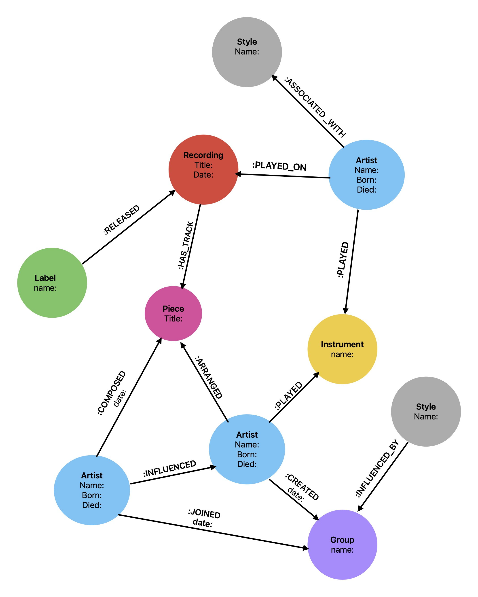

:stylesheet: theme.css
:stylesdir: config

== A slice of Jazz history 

=== Graphing the musical history behind Miles Davis' 1957 album, _Birth of the Cool_

In 1957 Capitol Records released _Birth of the Cool_ and after that, things just weren't the same.

But how did this masterpiece come about? Did it just come 'out of the blue'? Of course not, there was a whole history of artists interacting, building styles, developing relationships and ways of playing which gradually built towards this recording. 

==== Graphing history
Miles Davis and the shifting group of artists who made up his band, 'nonet', recorded the album during a series of sessions between 1949 and 1950. The tracks were composed and arranged by a number of greats, including https://en.wikipedia.org/wiki/Gerry_Mulligan[Gerry Mulligan] and https://en.wikipedia.org/wiki/Gil_Evans[Gill Evans].

Each of these artists had a plethora of creative influences, and togehter they had a decisive influence on Jazz, in particular Bebop and Cool Jazz. With all this in mind, let's take a look at the first data modeling sketch. 

==== Data modelling Jazz 
This model captures the nouns of the story as nodes for the graph. See [the original sketch for this graph].

===== Nodes include: 

* artists/musiscians
* pieces of music
* recordings  
* instruments
* musical styles
* record labels
* groups

