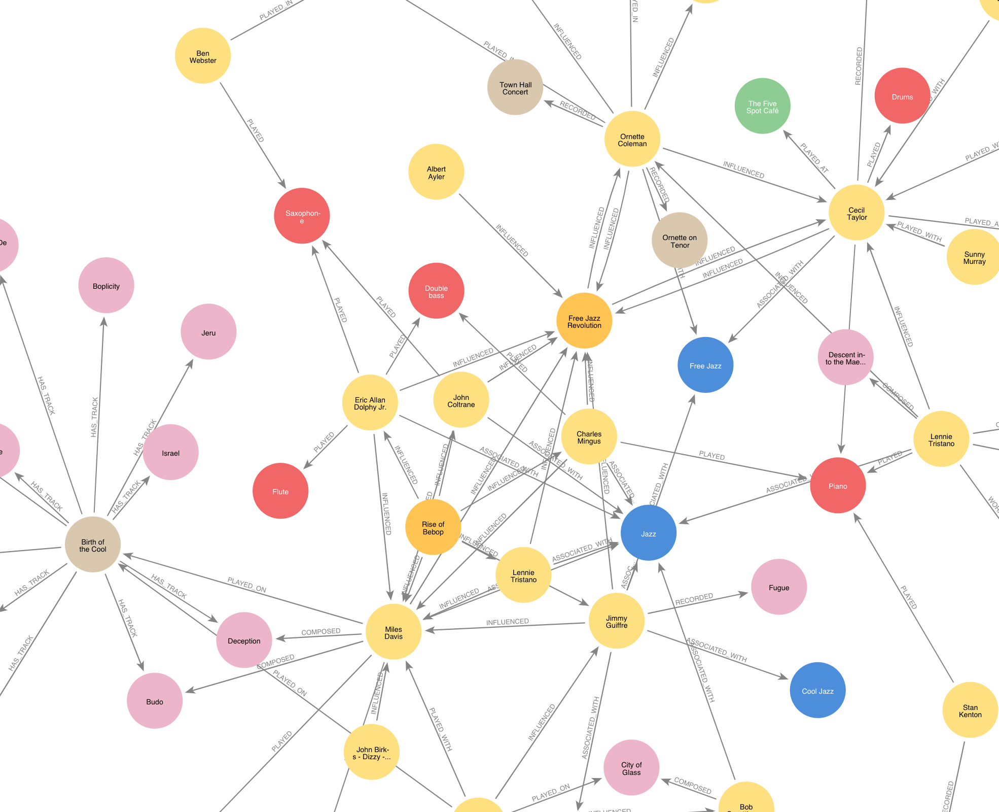
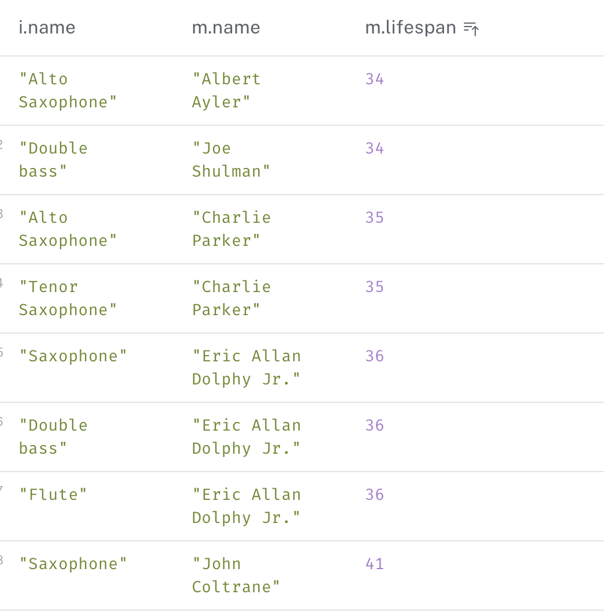

image::images/miles.jpeg[]
== A slice of Jazz history 

=== Graphing the story behind Miles Davis' 1957 album, _Birth of the Cool_

In 1957 Capitol Records released _Birth of the Cool_ and after that, things just weren't the same. Cool Jazz was about to hit the big time and Miles Davis was at least partly responsible.

But how did this modern jazz classic come about? Did it just appear 'out of the blue'? Of course not, there was a whole history of artists interacting, building styles, developing relationships and ways of playing which gradually built towards this recording. 

==== An interesting finding
While pulling together this dataset, one thing which struck me was how young some of these musicians died. Having said that, the lifespan of drummers seems to be enormous. 

For the detail, please see link:#interesting[this Cypher query, which gives you artists, their lifespan, and their instrument of choice]. But, the main takeaway - if you're considering a career in jazz, pick up the drum sticks, not the bass. And whatever you do, stay away from the saxophone...

[[setup]]
NOTE: You can replicate the database using https://neo4j.com/cloud/aura-free/[a free Neo4j Aura instance] and the query saved in https://github.com/barrynormal/NeoTest/blob/main/data/input.py[the input.py file].

==== Graphing history
Miles Davis and the shifting group of artists who made up his band, 'nonet', recorded 'Birth of the Cool' during a series of sessions between 1949 and 1950. The tracks were composed and arranged by a number of greats, including https://en.wikipedia.org/wiki/Gerry_Mulligan[Gerry Mulligan] and https://en.wikipedia.org/wiki/Gil_Evans[Gill Evans].

Each of these artists had a plethora of creative influences, and togehter they had a decisive influence on Jazz, in particular Bebop and Cool Jazz. With all this in mind, let's take a look at the data modeling. 

==== Data modelling Jazz 
This model captures the *nouns* of the story as *nodes* for the graph. 
*Actions* are represented as *relations*. 
Some additional facts and figures, such as dates and names are recorded as properties of the nodes and occasionally, the relations.

See https://github.com/barrynormal/NeoTest/blob/main/images/sketch.png[the original sketch for this graph].

[width=100%]
[cols="1,2,2"]
|===
|Nodes include |Relations include |data model (click to enlarge)

a| 
* artists (musicians)
* pieces (of music)
* recordings  
* instruments
* musical styles
* record labels
* groups
a|
* composed (there are often more then one to a piece)
* arranged (not always mentioned)
* played (linking musicians with their instruments)
* played with (live performances)
* played on (for artists appearing on recordings)
* influenced (creative input from one to another)
* created (bands, groups, record)
* associated with (musical style)
* has track (to associate pieces with recordings)

a|image:images/jazzDataModel.jpg[400,500, link=https://github.com/barrynormal/NeoTest/blob/one/images/jazzDataModel.jpg]

|===

==== The full graph
Although this is only a slice of the data available on the creation of 'Birth of the cool', it quickly becomes apparrent just how much of a beautiful, organic collaboration Jazz really was, in the 1940s and '50s.

==== Some interesting Cypher queries [[interesting]]
If you link:#setup[recreated the database] earlier, you can run these queries against your instance by simply cutting and pasting them into the `+Neo4j$+` prompt at the top of the page.

===== *Who actually played on 'Birth of the Cool' ?* 
[source,cypher]
----
[MATCH p=()-[:PLAYED_ON]->(birthOfCool) RETURN p LIMIT 25;]
----
===== *Who played which instrument?*
[source,cypher]
----
MATCH p=(Musician)-[:PLAYED]->(Instrument) RETURN p LIMIT 25;
----
===== *A breakdown of artists by instrument, showing lifespan*
[source,cypher]
----
Match (m:Musician) where m.died IS NOT NULL SET m.lifespan = m.died - m.born
Match (i:Instrument)-[:PLAYED]-(m:Musician) WHERE m.lifespan IS NOT NULL RETURN i.name,m.name, m.lifespan
----

